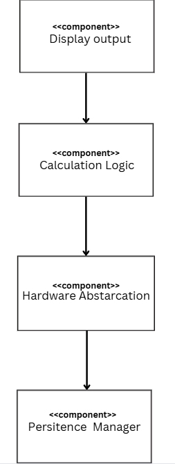

# Architektur

**Schichtenarchitektur**:

## Komponentendiagramm

| | **Komponente** | **Requirements** |
|:-:|:---|:---|
| 4 | **Display output** | Req. 1.1, Req. 1.2, Req. Req. 4.1 |
| 3 | **Calculation Logic (Anwendungslogik/Core)** | |
| 2 | **Hardware Abstraction** | Req. 1.4, Req. 1.5 |
| 1 | **Persistence Manager** | |

**Verantwortlichkeiten der Komponenten:**

| **Komponente** | **Rolle** | **Verantwortlichkeiten** |
|:---|:---|:---|
| **Display output** | Schnittstelle zum Benutzer | Darstellung des Aktuellen Arteriellen und Venösen Drucks und der Verbleibenden Dialysezeit |
| **Calculation Logic (Anwendungslogik/Core)** | Geschäftslogik und Steuerung | |
| **Hardware Abstraction** | Bindeglied zur Sensorik | Simulation der Messung des Venösen und Arteriellen Drucks |
| **Persistence Manager** |Datenverwaltung| |
