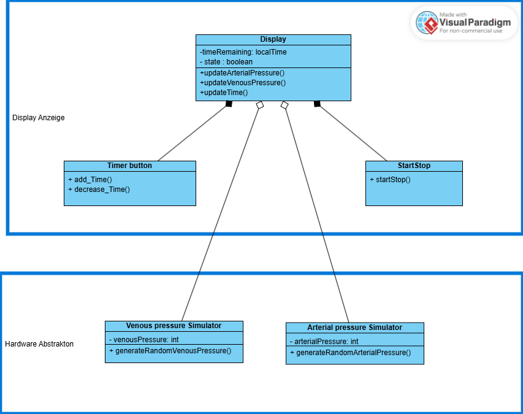
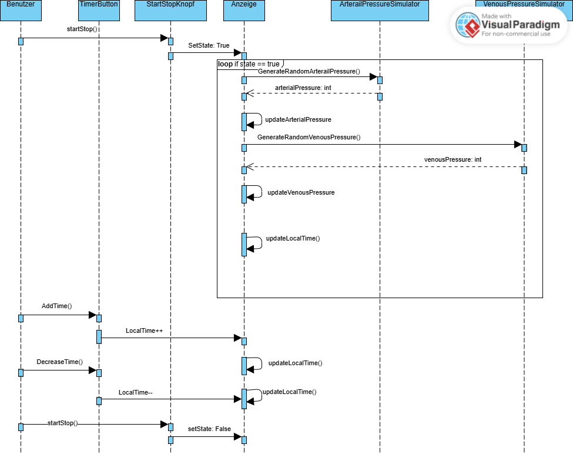
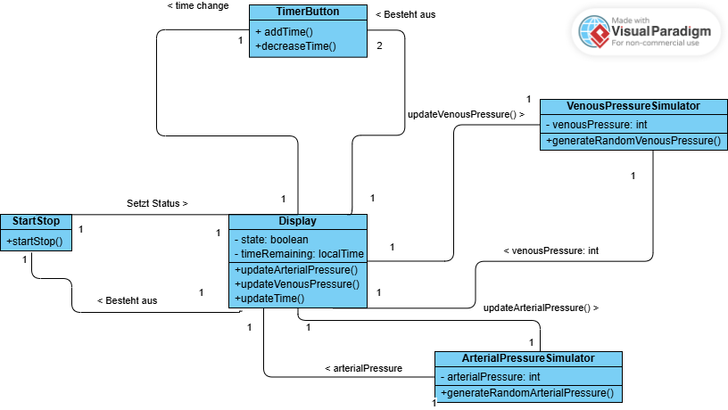

# Design

## Klassendiagramm

In Folgendem Klassendiagramm werden die Klassen des 1 Sprints, inklusive ihrer Parameter, Methoden und Beziehung zueinander dargestellt

## Sequenzdiagramm

## Kommunikationsdiagramm

