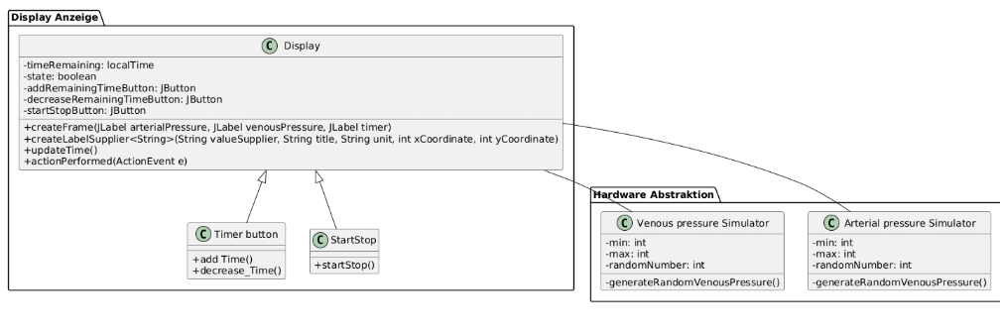
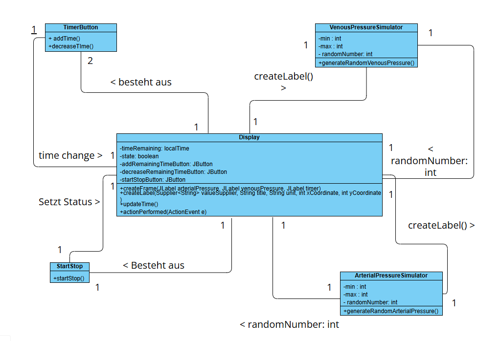

# Design

## Klassendiagramm

In Folgendem Klassendiagramm werden die Klassen des 1 Sprints, inklusive ihrer Parameter, Methoden und Beziehung zueinander dargestellt

## Sequenzdiagramm

## Kommunikationsdiagramm

## Designpatterns

| Klasse                     | Design-Pattern | Grund                                                                                                                      |
|----------------------------|----------------|----------------------------------------------------------------------------------------------------------------------------|
| Display                    | Observer       | Display muss automatisch aktualisiert werden, sobald sich einer der dargestellten Werte ändert. Durch das Observer pattern wird die Anzeige von den Simulatoren entkoppelt |
| TimerButton                | Command        | Verantwortlich für die Verarbeitung der Veränderung der Dialysezeit durch Benutzer interaktion       |
